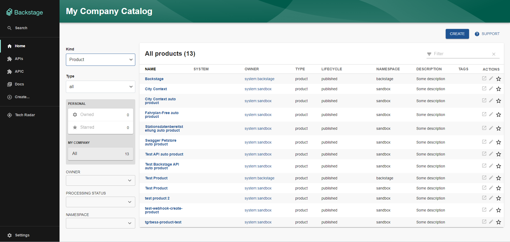

# APIC Entity Provider Plugin

Welcome to the APIC EntityProvider backend plugin, a plugin that will bring your IBM APIC data to Backstage!

Read more about why we built this plugin and what else is available [here](https://croz.net/news/backstage-plugin-ibm-apic/?utm_source=newsletter&utm_medium=github&utm_campaign=Tool+of+Choice).

Read about [our journey with Backstage](https://croz.net/news/tool-of-choice-backstage/?utm_source=newsletter&utm_medium=github&utm_campaign=Tool+of+Choice) and how me successfully integrated it into our toolchain.



## Getting started with plugin

Your plugin has been added to the example app in this repository, meaning you'll be able to access it by running `yarn
start` in the root directory, and then navigating to [/apic-public](http://localhost:3000/apic-public).

You can also serve the plugin in isolation by running `yarn start` in the plugin directory.
This method of serving the plugin provides quicker iteration speed and a faster startup and hot reloads.
It is only meant for local development, and the setup for it can be found inside the [/dev](/dev) directory.

## Standalone run

For standalone run, the standalone router is exposed (located at `src\service\standaloneRouter.ts`) with a method
for synchronization that you can access by navigating to `/apic-public-standalone/syncApic`.

Exposed method triggers sync with IBM API Connect to fetch all entities related to the defined provider.
The configuration for the provider is provided as environment variables located inside .env file.


## Installation instructions

Install the plugin into backstage:

```
cd packages/backend
yarn add @croz/plugin-ibm-apic-backend
yarn install
```

Add proxy config to the app-config.yaml file:

```
catalog:
  providers:
    ibmApic:
      default:
        baseUrl: ${IBM_APIC_API_URL}
        # provider/your-realm
        realm: ${IBM_APIC_REALM}
        clientId: ${IBM_APIC_CLIENT_ID}
        clientSecret: ${IBM_APIC_CLIENT_SECRET}
        username: ${IBM_APIC_SERVICE_ACCOUNT_USERNAME}
        password: ${IBM_APIC_SERVICE_ACCOUNT_PASSWORD}
```

Register plugin inside the catalog. The catalog is located at `packages/backend/src/plugins/catalog.ts`

```
...
import {APICEntityProcessor, APICEntityProvider} from "@croz/plugin-ibm-apic-backend";
...


...
    const builder = CatalogBuilder.create(env);
    builder.addProcessor(new ScaffolderEntitiesProcessor());
    
    const cacheService = env.cache.getClient();

    const apicEntityProviders = APICEntityProvider.fromConfig(env.config, {
        id: 'default',
        logger: env.logger,
        cache: cacheService,
        database: env.database,
        schedule: env.scheduler.createScheduledTaskRunner({
             frequency: {minutes: 30},
             timeout: {minutes: 1},
             initialDelay: {seconds: 15}
        }),
    });
    builder.addEntityProvider(
        apicEntityProviders,
    );
    
    const entityProcessor = new APICEntityProcessor(env.config, env.logger, cacheService)
    builder.addProcessor(entityProcessor)
...
```

Catalog is refreshed every 30 minutes.


